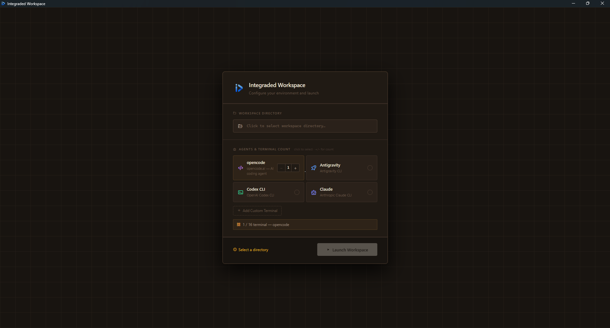
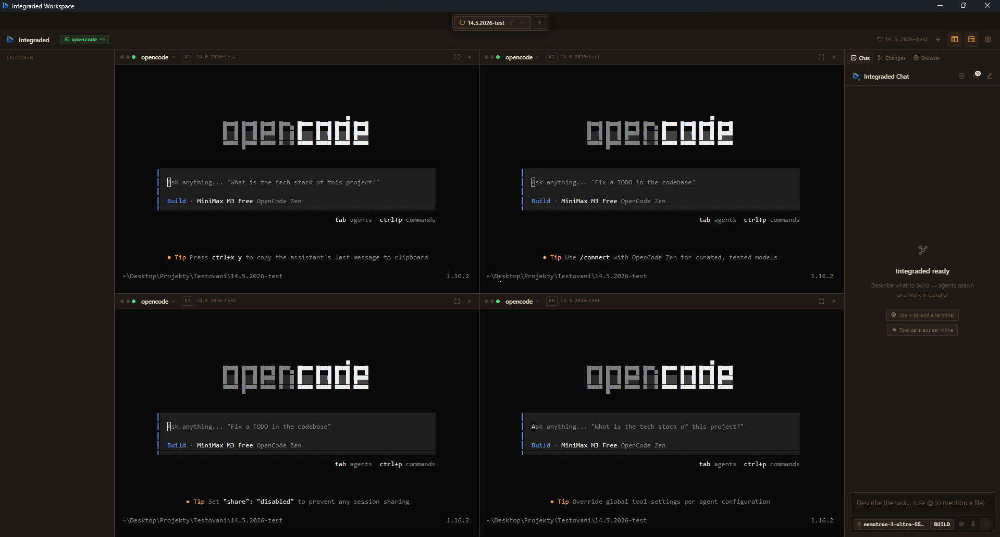
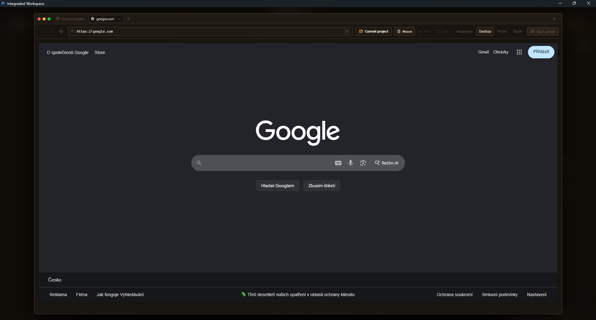

<div align="center">


# Integraded Workspace

**An open-source desktop IDE for running and orchestrating multiple AI coding agents simultaneously.**

[](LICENSE)
[](https://v2.tauri.app)
[](https://react.dev)
[](https://www.typescriptlang.org)
[]()
[]()

---

*Built with Tauri v2 · React 19 · TypeScript · Rust*

> **Vibe coded** — this entire project was built through vibe coding by **S1ntr**. No traditional line-by-line grind; pure intent-driven development with AI agents doing the heavy lifting.

</div>

---

## Table of Contents

- [Overview](#overview)
- [Screenshots](#screenshots)
- [Features](#features)
- [Technology Stack](#technology-stack)
- [System Requirements](#system-requirements)
- [Installation](#installation)
  - [Prerequisites](#prerequisites)
  - [Clone and Run](#clone-and-run)
- [Building for Production](#building-for-production)
- [First Launch & Setup](#first-launch--setup)
- [Usage Guide](#usage-guide)
- [Project Structure](#project-structure)
- [Configuration](#configuration)
- [Contributing](#contributing)
- [License & Disclaimer](#license--disclaimer)
- [Authors](#authors)

---

## Overview

**Integraded Workspace** is a native desktop application that lets you spin up and coordinate multiple AI coding agents inside a single, unified interface. Instead of jumping between terminal windows and browser tabs, everything lives in one place:

- Run up to **16 AI agents in parallel** — Claude CLI, OpenAI Codex, opencode.ai, Antigravity, or any custom shell tool
- A central **AI Orchestrator Chat** that reads your natural-language requests and distributes sub-tasks to each agent automatically
- An **embedded browser** pointed at your localhost dev server so you can preview changes without leaving the app
- A **real-time file-change tracker** showing exactly what each agent touched, with line-by-line diffs
- A built-in **code editor** with syntax highlighting, search/replace, and a side-by-side diff view

The project is designed for power users and researchers who want to experiment with multi-agent AI-assisted development workflows.

---

## Screenshots

### Onboarding — Workspace Setup



*On first launch, pick your workspace folder and choose which agents to run — opencode, Claude, Codex CLI, Antigravity, or any custom terminal. You can run up to 16 agents in parallel.*

---

### Main Workspace — Multi-Agent Grid



*Four opencode agents running simultaneously in a 2×2 grid. The file explorer sits on the left, the Integraded Chat orchestrator on the right. Each terminal is a fully independent PTY session — agents work in parallel on the same codebase.*

---

### Built-In Browser



*The integrated browser lets you open any URL or your live localhost dev server without leaving the app. Switch between Desktop, Phone, Tablet, and Responsive presets instantly. Use the element picker to send any UI element directly into the orchestrator chat.*

---

## Features

### Multi-Agent Terminal Grid
Run up to **16 terminal sessions** simultaneously. Each panel can be a plain shell or a specific AI agent (Claude, opencode, Codex, Antigravity, or any custom CLI tool). Drag panels to reorder, resize the grid freely, open or close agents at any time.

### AI Orchestrator Chat *(Alpha)*
A central chat powered by your chosen LLM provider. It understands natural-language requests, breaks them down into sub-tasks, dispatches those tasks to the running agents, monitors their output, detects input prompts, and summarizes completions. Think of it as a project manager sitting above all your agents.

> **Note:** The Orchestrator Chat is functional but currently in **alpha**. It is actively being tested and refined. Occasional unexpected behavior, missed dispatches, or incorrect responses may occur. Use it as an experimental feature — feedback and bug reports are welcome.

### Multi-LLM Provider Support
Connect to any of these providers through the Settings dialog. API keys are stored encrypted on disk — never in plain text.

| Provider | Notes |
|----------|-------|
| Anthropic (Claude) | claude-opus-4, claude-sonnet-4, claude-haiku-4 |
| OpenAI | GPT-4o, o3, o4-mini |
| DeepSeek | deepseek-chat, deepseek-reasoner |
| Mistral | All Mistral models |
| Google Gemini | Gemini 2.0 / 2.5 |
| Grok (xAI) | grok-3, grok-3-mini |
| Together AI | 200+ open-source models |
| OpenRouter | Aggregated model access |
| Ollama (local) | Any locally-installed model |
| LM Studio (local) | Any LM Studio model |

### Integrated Browser
An embedded browser window that points to your localhost development server. Features:
- Device presets: Responsive, Desktop, iPhone SE/Pro, Android, Tablet
- Element picker — click any element and send it to the orchestrator chat
- Region selector — select a UI region and export it as SVG directly into chat
- No context-switching: see your live app changes without leaving Integraded

### File Explorer & Code Editor
- Sidebar file tree with drag-and-drop and right-click context menus
- Built-in viewer/editor with syntax highlighting for JS, TS, JSON, HTML, CSS, XML
- Search and replace within files
- Diff view — compare current file state against the baseline snapshot
- "View as new file" toggle for raw diff viewing

### Real-Time Change Detection
Every 2.5 seconds, Integraded scans your workspace and compares the current state against a snapshot taken when you opened the session. New files and modified files are highlighted in the Changes Viewer panel with **line-level LCS diffs** so you can see exactly what each agent changed.

### Persistent Chat History
Chat sessions are automatically saved to `~/chat-history/`. You can load previous sessions, continue conversations, or archive them.

### Workspace Sandboxing
The Rust backend enforces path validation on every file operation — agents and tools cannot read or write files outside the registered workspace directory. This prevents accidental (or malicious) access to files outside your project.

### Encrypted Credential Storage
API keys and provider configuration are stored using the OS keyring (Windows Credential Manager, macOS Keychain, Linux Secret Service). Keys are never written to disk in plain text.

---

## Technology Stack

| Component | Technology | Version |
|-----------|-----------|---------|
| Desktop Framework | Tauri | v2.11+ |
| Frontend Framework | React | 19 |
| Language (Frontend) | TypeScript | 5.8 |
| Language (Backend) | Rust | stable |
| Build Tool | Vite | 7 |
| Terminal Emulator | xterm.js | 6 |
| PTY Backend | portable-pty | 0.8 |
| Async Runtime | Tokio | 1.x |
| Icon Library | Boxicons | 2.1.4 |
| Package Manager | npm / pnpm | — |

---

## System Requirements

| Platform | Minimum |
|----------|---------|
| **Windows** | Windows 10 (64-bit). WebView2 is included with Windows 11; on Windows 10 it auto-installs. |
| **macOS** | macOS 10.15 Catalina or later |
| **Linux** | Ubuntu 22.04+ or equivalent; requires WebKitGTK |

**RAM:** 4 GB minimum, 8 GB recommended (more agents = more RAM)  
**Disk:** ~500 MB for toolchain + build artifacts

---

## Installation

### Prerequisites

You need three things installed before you can run Integraded from source. Follow each step carefully — this is a one-time setup.

---

#### Step 1 — Install Node.js

Node.js powers the frontend build tools.

1. Go to [nodejs.org](https://nodejs.org) and download the **LTS** version.
2. Run the installer and follow the prompts. Accept all defaults.
3. Verify in a terminal:
   ```bash
   node --version   # should print v18.x.x or later
   npm --version
   ```

---

#### Step 2 — Install Rust

Rust compiles the backend (the Tauri/Rust layer that handles terminals, files, etc.).

1. Go to [rustup.rs](https://rustup.rs) and run the installer for your platform.
   - **Windows:** download and run `rustup-init.exe`
   - **macOS / Linux:** paste the shown `curl` command into your terminal
2. Accept the default installation.
3. **Restart your terminal**, then verify:
   ```bash
   rustc --version   # should print rustc 1.7x.x
   cargo --version
   ```

---

#### Step 3 — Platform-specific dependencies

**Windows:**  
Nothing extra needed. WebView2 ships with Windows 11. On Windows 10 it installs automatically the first time you run the app.

**macOS:**
```bash
xcode-select --install
```

**Linux (Ubuntu/Debian):**
```bash
sudo apt update
sudo apt install libwebkit2gtk-4.1-dev libgtk-3-dev libayatana-appindicator3-dev librsvg2-dev patchelf
```
For other distributions see the [Tauri prerequisites page](https://v2.tauri.app/start/prerequisites/).

---

### Clone and Run

Once the prerequisites are installed, clone the repository and start the app:

```bash
# 1. Clone the repo
git clone https://github.com/S1ntr/integraded-workspace.git
cd integraded-workspace

# 2. Install JavaScript dependencies
npm install

# 3. Launch in development mode (with hot-reload)
npm run tauri dev
```

> **First launch is slow** — Rust needs to compile the backend (~2–5 minutes). Subsequent launches are fast because the output is cached.

A native app window will open automatically. The Vite dev server runs on `http://localhost:1420` in the background.

---

## Building for Production

To compile a standalone installable binary:

```bash
npm run tauri build
```

Output is placed in `src-tauri/target/release/bundle/`:
- **Windows:** `.exe` installer + `.msi`
- **macOS:** `.app` bundle + `.dmg`
- **Linux:** `.deb` package + `.AppImage`

---

## First Launch & Setup

1. **Select a workspace directory** — On first launch the onboarding screen asks you to choose a project folder. This becomes the sandbox root; agents can only access files inside it.
2. **Choose how many agents** — Pick 1–16 terminal panels. You can change this later.
3. **Add your API key** — Open Settings (gear icon, top right) → choose your LLM provider → paste your API key → Save.
4. **Launch an agent** — Click the `+` button in any terminal panel → select Claude, opencode, Codex, or Shell → the agent starts in that panel.
5. **Talk to the Orchestrator** — Type your request in the Chat panel on the left. The orchestrator will read the active agents, break your task into steps, and dispatch commands.

---

## Usage Guide

### Running agents manually

Each terminal panel is a real PTY (pseudo-terminal). You can type directly into it just like a normal terminal, or let the orchestrator drive it. Switch between agent types at any time by clicking the panel header.

### Using the Orchestrator Chat

- `@agent-name` — mention a specific agent to direct a message to it
- Attach file contents by clicking the paperclip icon
- The orchestrator auto-detects when an agent is waiting for input and can respond automatically

### Embedded Browser

Click the browser icon in the toolbar. Type `localhost:PORT` in the address bar (matching your dev server). Use the device preset dropdown to test responsive layouts. Use the element picker (cursor icon) to click any element and automatically paste its details into the chat.

### Changes Viewer

Click the diff icon in the toolbar. All files modified since the session started are listed. Click any file to open an inline diff. Use "View as new file" to see the full file content.

### Keyboard Shortcuts

| Action | Shortcut |
|--------|---------|
| New terminal panel | `Ctrl+T` |
| Focus next panel | `Ctrl+Tab` |
| Open settings | `Ctrl+,` |
| Open file in editor | Double-click in sidebar |
| Send chat message | `Enter` |
| New line in chat | `Shift+Enter` |

---

## Project Structure

```
integraded-workspace/
├── public/                      # Static assets (logo, icons)
├── src/                         # React + TypeScript frontend
│   ├── components/
│   │   ├── Onboarding.tsx       # First-launch workspace setup wizard
│   │   ├── WorkspaceLayout.tsx  # Main app shell (sidebar + chat + terminals + browser)
│   │   ├── Sidebar.tsx          # File explorer tree with drag-drop
│   │   ├── ChatPanel.tsx        # Orchestrator chat UI
│   │   ├── TerminalGrid.tsx     # Resizable grid of terminal panels
│   │   ├── TerminalPanel.tsx    # Single xterm.js PTY terminal
│   │   ├── BrowserOverlay.tsx   # Embedded browser with device presets
│   │   ├── ChangesViewer.tsx    # Real-time file diff viewer
│   │   ├── FileViewerDialog.tsx # Code editor modal with syntax highlight
│   │   ├── SettingsDialog.tsx   # API keys & provider configuration
│   │   ├── SkillsTab.tsx        # Agent skills manager
│   │   └── Notification.tsx     # Toast notification system
│   ├── types/
│   │   └── browser.ts           # Shared TypeScript types
│   ├── assets/                  # Images, SVG assets
│   ├── App.tsx                  # Root component, workspace tab management
│   ├── main.tsx                 # ReactDOM entry point
│   └── index.css                # Complete design system (CSS variables + components)
├── src-tauri/                   # Rust backend
│   ├── src/
│   │   ├── main.rs              # Tauri app entry point
│   │   └── lib.rs               # Core: PTY sessions, file ops, IPC commands, sandboxing
│   ├── capabilities/
│   │   └── default.json         # Tauri IPC permission definitions
│   ├── icons/                   # App icons (all resolutions)
│   ├── Cargo.toml               # Rust dependencies
│   └── tauri.conf.json          # App name, version, window config, dev server URL
├── package.json                 # npm scripts and JS dependencies
├── vite.config.ts               # Vite bundler configuration
├── tsconfig.json                # TypeScript compiler config
├── index.html                   # HTML shell (CSP headers, Boxicons CDN)
└── pnpm-workspace.yaml          # pnpm workspace config
```

---

## Configuration

### App configuration

Located in `src-tauri/tauri.conf.json`:

| Setting | Value |
|---------|-------|
| Product name | Integraded Workspace |
| Version | 0.1.0 |
| Bundle identifier | com.ondra.integraded-workspace |
| Default window | 1280 × 850 |
| Minimum window | 800 × 560 |
| Dev server | http://localhost:1420 |

### API Keys

Managed entirely through the in-app Settings dialog. Keys are encrypted using the OS keyring — never stored in config files or environment variables. To add a key:

1. Click the gear icon (top right corner)
2. Select your LLM provider tab
3. Paste your API key
4. Click Save

### Agent customization

During onboarding (or by re-running the workspace setup) you can define custom CLI tools. Any command-line tool that accepts text input and produces text output can be used as an agent panel.

---

## Contributing

Contributions are welcome. Please open an issue first to discuss what you want to change, then submit a pull request.

1. Fork the repository
2. Create a feature branch: `git checkout -b feature/your-feature`
3. Commit your changes: `git commit -m "feat: add your feature"`
4. Push and open a Pull Request

Please keep PRs focused. One feature or fix per PR.

---

## License & Disclaimer

This project is licensed under the **MIT License** — see the [LICENSE](./LICENSE) file for the full text.

**Important — please read:**

> THE SOFTWARE IS PROVIDED "AS IS", WITHOUT WARRANTY OF ANY KIND, EXPRESS OR IMPLIED. THE AUTHORS AND COPYRIGHT HOLDERS SHALL NOT BE LIABLE FOR ANY CLAIM, DAMAGES, OR OTHER LIABILITY ARISING FROM THE USE OF THIS SOFTWARE.

By using Integraded Workspace you agree that:

- The authors bear **no responsibility** for how you use this software or what actions you take with it.
- You are solely responsible for complying with the **Terms of Service** of any third-party AI providers (Anthropic, OpenAI, Google, etc.) accessed through this application.
- This project is intended for **legitimate development, research, and educational purposes only**. Any use that violates applicable laws or third-party agreements is entirely the user's responsibility.
- The authors provide **no guarantees** about security, correctness, or fitness for any particular purpose.

If you redistribute this software (modified or unmodified), you must include the original copyright notice and this license.

---

## Authors

**S1ntr** — [github.com/S1ntr](https://github.com/S1ntr)

---

<div align="center">

*Star the repo if you find it useful. Issues and PRs are welcome.*

</div>
